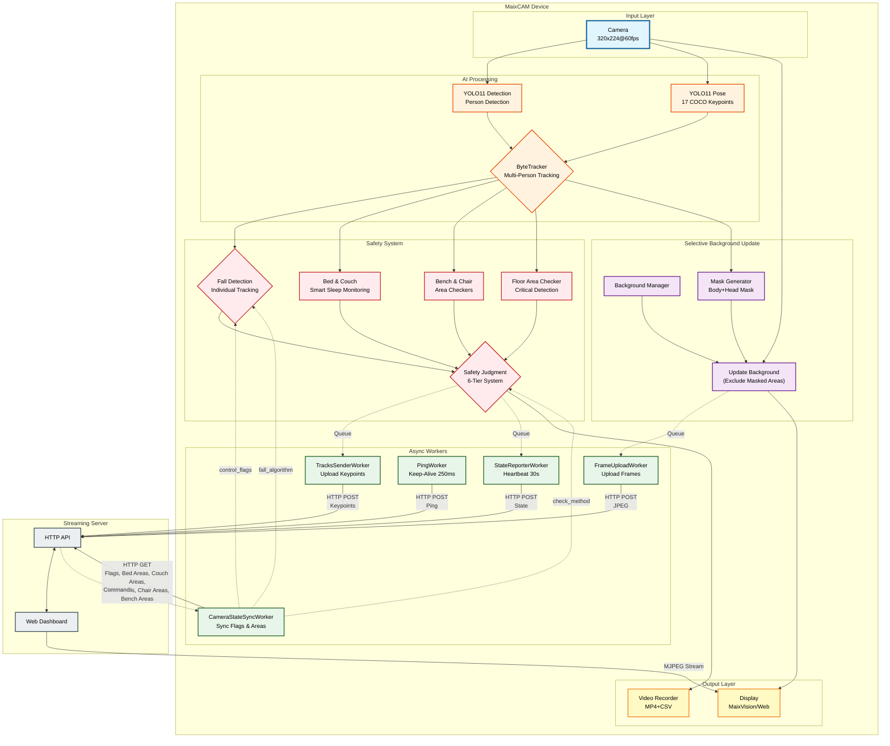
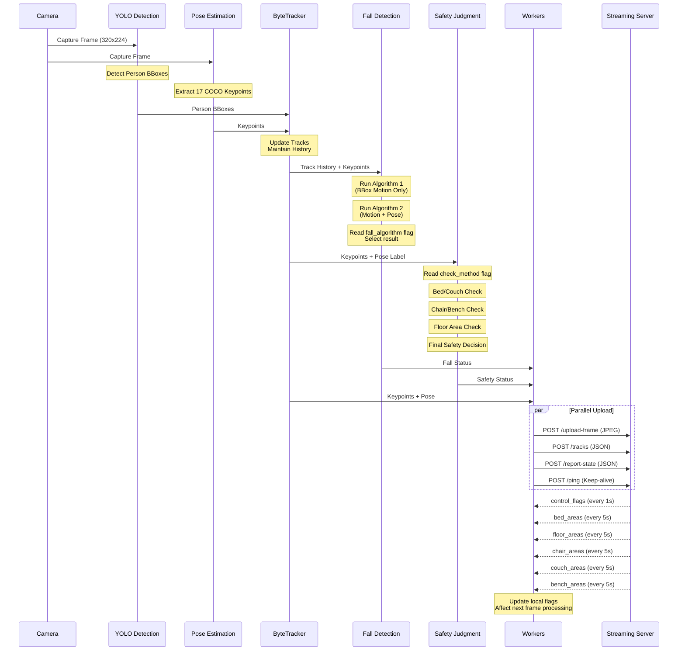
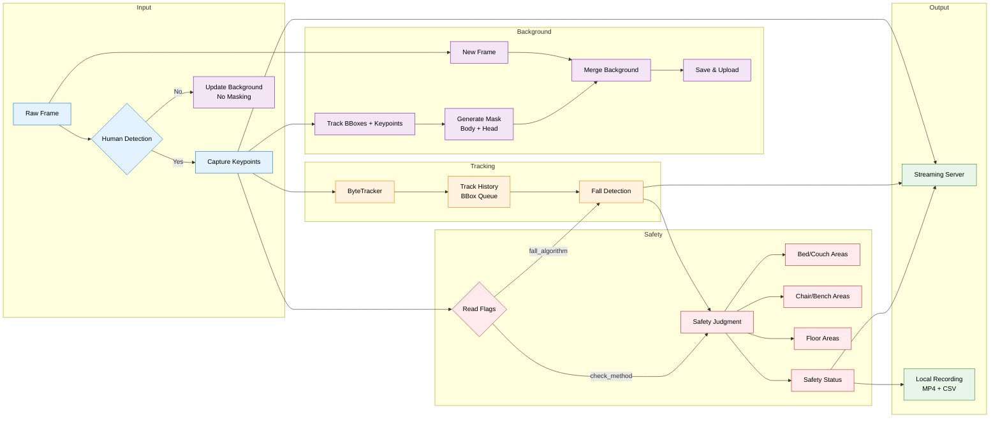
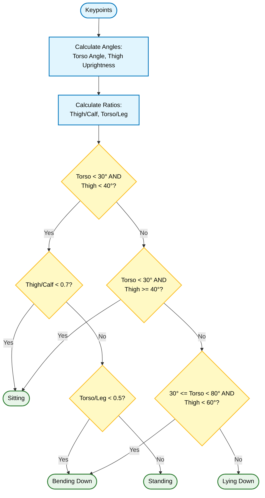
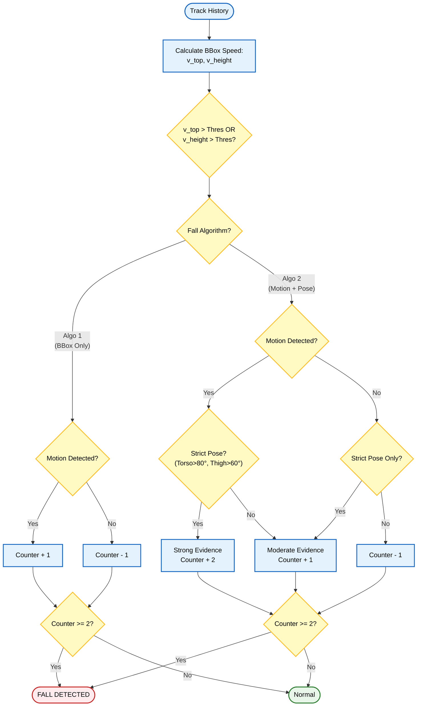
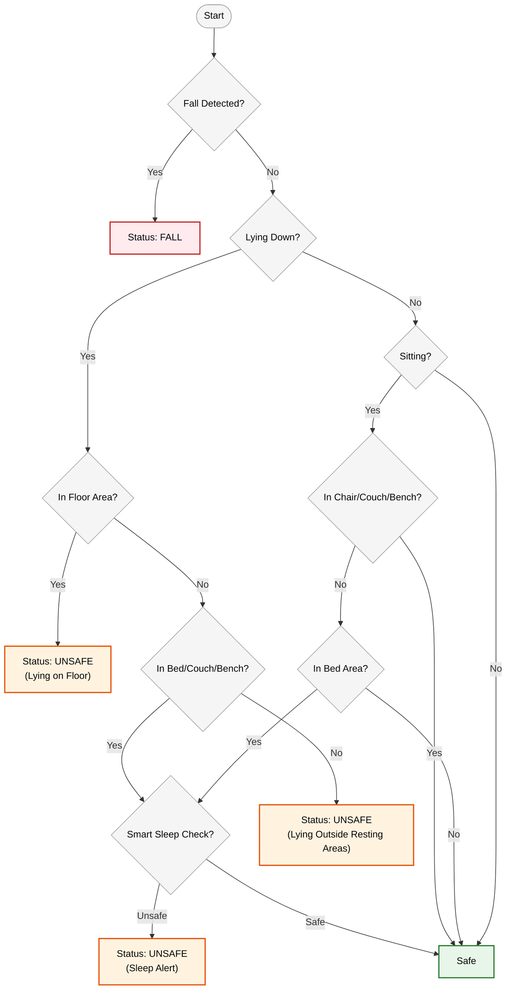
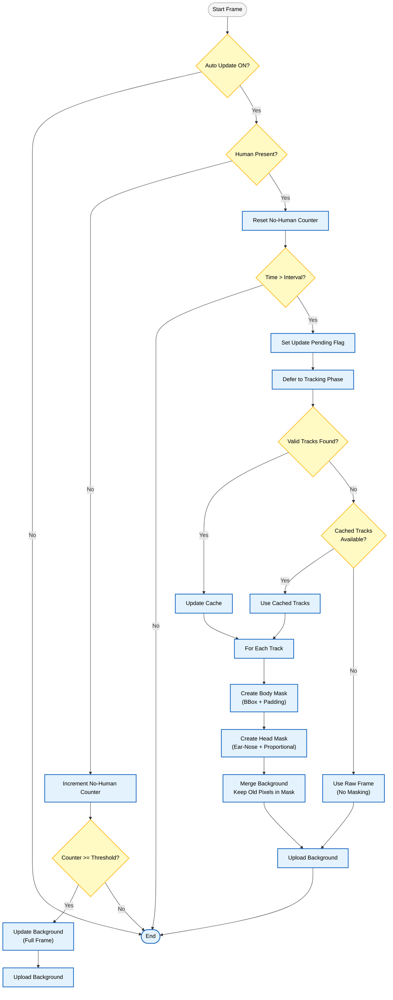
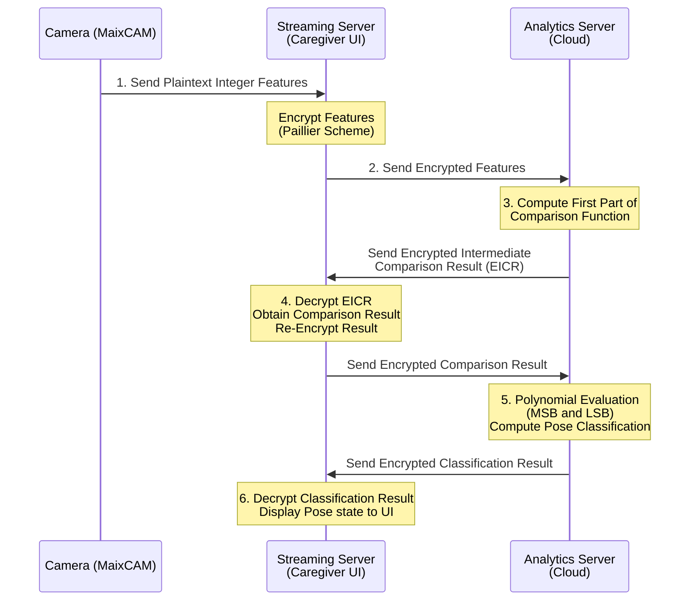

# Privacy-Preserving Patient Monitoring System - Camera Side


A privacy-preserving patient monitoring system built for the **MaixCAM** platform that provides real-time pose estimation, fall detection, and remote monitoring capabilities while protecting patient privacy through intelligent background management and optional homomorphic encryption.

> **⚠️ Important Requirement**: This software is optimized for the **MaixCAM hardware platform**. However, a **PC-compatible version** (`main-alt.py`) is provided for development and testing on standard computers with webcams.

## Table of Contents

- [System Architecture](#-system-architecture)
- [Features](#-features)
- [Architecture](#️-architecture)
- [Installation & Setup](#-installation--setup)
- [Configuration](#️-configuration)
- [Output Files](#-output-files)
- [Technical Details](#-technical-details)
- [Privacy Design](#-privacy-design)
- [Troubleshooting](#-troubleshooting)
- [License & Acknowledgments](#-license--acknowledgments)
- [API Endpoints](#-api-endpoints)
- [Support](#-support)

## 📋 System Architecture

This project is one component of a three-part distributed system:

| Camera (MaixCAM) | Analytics Server (Intermediate) | Streaming Server (Caregiver UI) |
| :--- | :--- | :--- |
| • Pose Estimation<br>• Fall Detection<br>• Tracking<br>• Feature Extraction & Encryption<br>• Safety Checking | • Polynomial Evaluation of Encrypted Features<br>• Privacy-Preserving Pose Classification | • JPEG Streaming<br>• Web Dashboard<br>• Camera Management<br>• Alert System |

### Component Overview

| Component | Repository | Description | Status |
|-----------|------------|-------------|--------|
| **Camera** | [private-cctv](https://github.com/yudhisthereal/Private-Surveillence-MaixCAM) | Edge device with pose estimation, fall detection, and privacy protection | ✅ Active |
| **Analytics Server** | [HME pose classification](https://github.com/yudhisthereal/fall-detection-analytics/) | Intermediate server for polynomial evaluation of encrypted features | ✅ Active |
| **Streaming Server** | [fall-detection-streaming](https://github.com/yudhisthereal/fall-detection-streaming/) | Web interface for caregivers to monitor patients | ✅ Active |

## ✨ Features

### 🎯 Core Functionality

- **Real-time Pose Estimation**: Accurate human pose detection using YOLO11 pose model (17 COCO keypoints)
- **Multi-person Tracking**: Track multiple individuals with unique IDs using ByteTracker algorithm
- **Fall Detection**: Intelligent fall detection with two algorithms:
  - **Algorithm 1**: Bounding box motion analysis only
  - **Algorithm 2**: Motion + strict pose verification (torso_angle > 80° AND thigh_uprightness > 60°)
- **Selective Background Update**: Automatic background updating with intelligent human masking
- **Remote Monitoring**: Web interface for remote viewing and control

### 🔐 Privacy-Preserving Features

- **Integer Feature Extraction**: Consistent extraction of integer body measurements. This serves as the critical first step for multi-party Homomorphic Encryption (HME) for privacy-preserving pose classification.
- **Smart Background Management**: Auto-update background that masks out human regions:
  - Preserves body bounding box areas in old background
  - Preserves head area (ear-nose-ear keypoints) with proportional padding
  - Updates non-human areas with new frame content
- **Mask Visualization** (PC version): Color-coded overlay showing masked regions (white=body, red=head)
- **Edge Processing**: Feature extraction, and fall detection runs completely locally on the device to ensure patient privacy.

### 🎥 Recording System

- **Smart Recording**: Automatically starts/stops based on human presence
  - Starts after 3 consecutive frames with human detection
  - Stops after 5 seconds without humans or 90-second timeout
- **Dual Output**: Saves both video recordings (MP4) and skeleton CSV data
- **Timestamped Files**: Organized storage with proper timestamps

### 🌐 Web Interface

- **Live Streaming**: View real-time camera feed via MJPEG streaming
- **Remote Control**: Toggle features without physical access to device
- **Configuration**: Adjust settings through intuitive web controls
- **Camera Registration**: Request-based camera approval system

### 🛡️ Safety Features

The system uses a unified safety judgment system with specific area types:

1. **Bed & Couch Area Checkers (Smart Monitoring)**: Tracks time spent in resting areas with time-of-day awareness
   - Detects "unsafe sleep" based on `max_sleep_duration`
   - Detects "oversleeping" based on `bedtime` and `wakeup_time` parameters
   - Distinguishes between normal night sleep and problematic daytime napping

2. **Bench & Chair Area Checkers**: Monitors semi-stationary areas
   - **Chair**: Optimized for sitting poses (HIP check method)
   - **Bench**: Supports both sitting and lying detection

3. **Floor Area Checker**: Detects when patients are lying on the floor
   - Uses the global check method to detect floor contact
   - Critical safety alert for fall situations
   - Distinguishes between safe lying (in bed/couch) and unsafe lying (on floor)

**Safety Judgment Rules (in priority order):**
1. Fall detection always takes precedence
2. If lying down AND in floor area → UNSAFE (lying on floor)
3. If in bed/couch area AND (too long OR past wakeup) → UNSAFE (sleep monitoring)
4. If lying down AND not in bed/couch/bench area → UNSAFE (lying outside resting areas)
5. Otherwise → SAFE (tracking)

## 🏗️ Architecture

### System Architecture Diagram


```mermaid
graph TB
    subgraph Camera [MaixCAM Device]
        subgraph Input [Input Layer]
            Cam["Camera<br/>320x224@60fps"]
        end

        subgraph AI [AI Processing]
            Det["YOLO11 Detection<br/>Person Detection"]
            Pose["YOLO11 Pose<br/>17 COCO Keypoints"]
            Track{"ByteTracker<br/>Multi-Person Tracking"}
            Cam --> Det
            Cam --> Pose
            Det --> Track
            Pose --> Track
        end

        subgraph Safety [Safety System]
            Fall{"Fall Detection<br/>Individual Tracking"}
            BedArea["Bed & Couch<br/>Smart Sleep Monitoring"]
            BenchArea["Bench & Chair<br/>Area Checkers"]
            FloorArea["Floor Area Checker<br/>Critical Detection"]
            SafetyJudge{"Safety Judgment<br/>6-Tier System"}

            Track --> Fall
            Fall --> SafetyJudge
            Track --> BedArea
            Track --> BenchArea
            Track --> FloorArea
            BedArea --> SafetyJudge
            BenchArea --> SafetyJudge
            FloorArea --> SafetyJudge
        end

        subgraph Privacy [Selective Background Update]
            BG[Background Manager]
            Mask["Mask Generator<br/>Body+Head Mask"]
            Merge["Update Background<br/>(Exclude Masked Areas)"]

            Track --> Mask
            Cam --> Merge
            Mask --> Merge
            BG --> Merge
        end

        subgraph Workers [Async Workers]
            StateSync["CameraStateSyncWorker<br/>Sync Flags & Areas"]
            StateReporter["StateReporterWorker<br/>Heartbeat 30s"]
            FrameUpload["FrameUploadWorker<br/>Upload Frames"]
            TrackSender["TracksSenderWorker<br/>Upload Keypoints"]
            PingWorker["PingWorker<br/>Keep-Alive 250ms"]

            SafetyJudge -.->|Queue| TrackSender
            SafetyJudge -.->|Queue| StateReporter
            Merge -.->|Queue| FrameUpload
            StateSync -.->|control_flags| Fall
            StateSync -.->|check_method| SafetyJudge
            StateSync -.->|fall_algorithm| Fall
        end

        subgraph Output [Output Layer]
            Record["Video Recorder<br/>MP4+CSV"]
            Display["Display<br/>MaixVision/Web"]
        end

        SafetyJudge --> Record
        Merge --> Display
    end

    subgraph Streaming [Streaming Server]
        API[HTTP API]
        Dashboard[Web Dashboard]

        API <--> Dashboard
    end

    FrameUpload -->|"HTTP POST<br/>JPEG"| API
    TrackSender -->|"HTTP POST<br/>Keypoints"| API
    StateReporter -->|"HTTP POST<br/>State"| API
    PingWorker -->|"HTTP POST<br/>Ping"| API

    StateSync -->|"HTTP GET<br/>Flags, Bed Areas, Couch Areas,<br/>Floor Areas, Chair Areas,<br/>Bench Areas"| API

    API -.->|Commands| StateSync
    Dashboard -->|MJPEG Stream| Display

    classDef camera fill:#e1f5fe,stroke:#01579b,stroke-width:3px,color:#000000
    classDef ai fill:#fff3e0,stroke:#e65100,stroke-width:2px,color:#000000
    classDef safety fill:#ffebee,stroke:#c62828,stroke-width:2px,color:#000000
    classDef privacy fill:#f3e5f5,stroke:#6a1b9a,stroke-width:2px,color:#000000
    classDef workers fill:#e8f5e9,stroke:#1b5e20,stroke-width:2px,color:#000000
    classDef output fill:#fff9c4,stroke:#f57f17,stroke-width:2px,color:#000000
    classDef server fill:#eceff1,stroke:#37474f,stroke-width:2px,color:#000000

    class Cam camera
    class Det,Pose,Track ai
    class Fall,BedArea,BenchArea,FloorArea,SafetyJudge safety
    class BG,Mask,Merge privacy
    class StateSync,StateReporter,FrameUpload,TrackSender,PingWorker workers
    class Record,Display output
    class API,Dashboard server
```

### Main Components

```
private-cctv/
├── main.py                    # Main entry point with processing loop (MaixCAM)
├── main-alt.py                # PC-compatible version for development
├── config.py                  # Configuration and server settings
├── camera_manager.py          # Camera and model initialization
├── control_manager.py         # Control flags and state management
├── streaming.py               # Streaming server communication
├── tracking.py                # Multi-object tracking
├── workers.py                 # Async worker threads for streaming server
├── pose/
│   ├── pose_estimation.py    # YOLO11 pose estimation & integer features
│   └── judge_fall.py         # Fall detection algorithms (2 algorithms)
├── tools/
│   ├── bed_area_checker.py   # Bed area monitoring
│   ├── floor_area_checker.py # Floor area detection
│   ├── chair_area_checker.py # Chair area detection
│   ├── couch_area_checker.py # Couch area detection
│   ├── bench_area_checker.py # Bench area detection
│   ├── polygon_checker.py    # Shared polygon check methods (HIP, TORSO, etc.)
│   ├── safety_judgment.py    # Unified safety judgment
│   ├── skeleton_saver.py     # CSV skeleton data recording
│   ├── video_record.py       # Video recording with MJPEG codec
│   ├── wifi_connect.py       # Wi-Fi connectivity
│   ├── log_manager.py        # Centralized logging
│   └── time_utils.py         # Time utilities and profiling
├── hme_from_sona/            # HME encryption research (legacy)
├── model/                     # YOLO model files (.mud format)
└── static/                    # Web interface files
```

### Processing Pipeline


```mermaid
sequenceDiagram
    participant C as Camera
    participant D as YOLO Detection
    participant P as Pose Estimation
    participant T as ByteTracker
    participant F as Fall Detection
    participant S as Safety Judgment
    participant W as Workers
    participant SS as Streaming Server

    C->>D: Capture Frame (320x224)
    C->>P: Capture Frame

    Note over D: Detect Person BBoxes

    Note over P: Extract 17 COCO Keypoints

    D->>T: Person BBoxes
    P->>T: Keypoints
    Note over T: Update Tracks<br/>Maintain History

    T->>F: Track History + Keypoints
    Note over F: Run Algorithm 1<br/>(BBox Motion Only)
    Note over F: Run Algorithm 2<br/>(Motion + Pose)
    Note over F: Read fall_algorithm flag<br/>Select result

    T->>S: Keypoints + Pose Label
    Note over S: Read check_method flag
    Note over S: Bed/Couch Check
    Note over S: Chair/Bench Check
    Note over S: Floor Area Check
    Note over S: Final Safety Decision

    F->>W: Fall Status
    S->>W: Safety Status
    T->>W: Keypoints + Pose

    par Parallel Upload
        W->>SS: POST /upload-frame (JPEG)
        W->>SS: POST /tracks (JSON)
        W->>SS: POST /report-state (JSON)
        W->>SS: POST /ping (Keep-alive)
    end

    SS-->>W: control_flags (every 1s)
    SS-->>W: bed_areas (every 5s)
    SS-->>W: floor_areas (every 5s)
    SS-->>W: chair_areas (every 5s)
    SS-->>W: couch_areas (every 5s)
    SS-->>W: bench_areas (every 5s)

    Note over W: Update local flags<br/>Affect next frame processing
```

### Data Flow Diagram


```mermaid
graph LR
    subgraph Input
        A[Raw Frame] --> B{Human Detection}
        B -->|Yes| C[Capture Keypoints]
        B -->|No| D[Update Background<br/>No Masking]
    end

    subgraph Background
        C --> E[Track BBoxes + Keypoints]
        E --> F[Generate Mask<br/>Body + Head]
        A --> G[New Frame]
        F --> H[Merge Background]
        G --> H
        H --> I[Save & Upload]
    end

    subgraph Tracking
        C --> J[ByteTracker]
        J --> K[Track History<br/>BBox Queue]
        K --> L[Fall Detection]
    end

    subgraph Safety
        C --> M{Read Flags}
        M -->|fall_algorithm| L
        M -->|check_method| N[Safety Judgment]
        L --> N
        N --> O[Bed/Couch Areas]
        N --> P[Chair/Bench Areas]
        N --> Q[Floor Areas]
        N --> R[Safety Status]
    end

    subgraph Output
        R --> S[Streaming Server]
        L --> S
        C --> S
        R --> T[Local Recording<br/>MP4 + CSV]
    end

    classDef input fill:#e3f2fd,stroke:#1976d2,color:#000000
    classDef bg fill:#f3e5f5,stroke:#7b1fa2,color:#000000
    classDef track fill:#fff3e0,stroke:#f57c00,color:#000000
    classDef safety fill:#ffebee,stroke:#c62828,color:#000000
    classDef output fill:#e8f5e9,stroke:#388e3c,color:#000000

    class A,B,C input
    class D,E,F,G,H,I bg
    class J,K,L track
    class M,N,O,P,Q,R safety
    class S,T output
```


## 🚀 Installation & Setup

### ⚠️ Prerequisites - MAIXCAM DEVICE REQUIRED

This application **requires a MaixCAM device**. It will not run on conventional computers, Raspberry Pi, or other development boards.

#### Recommended Development Setup

1. **MaixVision IDE** (Highly Recommended)
   - Official IDE for MaixCAM development
   - Download from: [MaixVision Releases](https://github.com/sipeed/MaixVision/releases)
   - Features:
     - Direct file deployment to MaixCAM
     - Serial console output
     - Model file management
     - Live debugging capabilities

2. **Alternative: MaixPy IDE**
   - Legacy IDE option
   - May have compatibility issues with latest firmware

3. **Manual Deployment via SCP/SSH**
   - Transfer files using SCP protocol
   - Requires SSH access to MaixCAM

#### Hardware Requirements

- **MaixCAM device** (required - no substitutes)
- MicroSD card (8GB+ recommended)
- Wi-Fi network (2.4GHz recommended for better range)
- Power supply (USB-C, 5V/2A recommended)

### 💻 Development on PC / Laptop (Alternative)

For development and testing without a MaixCAM device, a PC-compatible version is available:

**Prerequisites:**
- Python 3.8+
- Webcam
- `mediapipe` (for multi-person pose estimation)
- `ultralytics` (for YOLO detection)
- `opencv-python`

**Setup:**
1. Create and activate a virtual environment:
   ```bash
   python -m venv venv
   source venv/bin/activate  # Linux/Mac
   # venv\Scripts\activate   # Windows
   ```
2. Install dependencies:
   ```bash
   pip install -r requirements.txt
   pip install mediapipe ultralytics opencv-python
   ```

**Running:**
Run the alternative main script:
```bash
python main-alt.py
```

**Key Differences:**
- Uses **MediaPipe Pose** (default) or YOLO11 for pose estimation
- Simulates MaixCAM hardware APIs using mocks
- Displays output in a standard OpenCV window ("Private CCTV")
- Resolution is adapted to **320x224** to match MaixCAM constraints
- **Includes mask visualization** (30% opacity overlay, white=body, red=head)

### Model Files Required

Place these files in `/root/models/` on your MaixCAM:

| File | Description |
|------|-------------|
| `yolo11n_pose.mud` | YOLO11 pose estimation model (17 keypoints) |
| `yolo11n.mud` | YOLO11 detection model (person detection) |

### Configuration

1. **Copy .env.example to .env** and configure:

```bash
STREAMING_SERVER_IP=your.server.ip
STREAMING_SERVER_PORT=8000
```

2. **Configure Wi-Fi** in `main.py` or via environment:

```python
SSID = "YOUR_WIFI_NAME"
PASSWORD = "YOUR_WIFI_PASSWORD"
```

### Deployment via MaixVision

1. Connect MaixCAM to your computer via USB
2. Open MaixVision IDE
3. Create a new project or open existing project
4. Copy all project files to the MaixCAM
5. Upload model files to `/root/models/`
6. Run the application from MaixVision

### Deployment via Manual Transfer

1. Upload all files to MaixCAM (using SCP or SD card)
2. Ensure model files are in `/root/models/`
3. Run the application:

```bash
python3 main.py
```

## ⚙️ Configuration

### Recording Parameters

```python
MIN_HUMAN_FRAMES_TO_START = 3      # Start after 3 human frames
NO_HUMAN_SECONDS_TO_STOP = 5       # 5 seconds at 60fps = 300 frames
MAX_RECORDING_DURATION_MS = 90000  # 90-second maximum recording
```

### Background Settings

```python
UPDATE_INTERVAL_MS = 10000         # Update background every 10 seconds
NO_HUMAN_CONFIRM_FRAMES = 10       # Confirm human absence with 10 frames
```

**Background Masking Parameters:**
- **Body Padding**: 20 pixels around track bounding box
- **Head Padding**: Proportional to ear-nose distance (max_ear_nose_distance * head_mask_factor)
- **Pixel Stepping**: 4 (optimization for performance)

### Fall Detection Parameters

```python
 fallParam = {
    "v_bbox_y": 0.3,              # Height shrinkage threshold (0.0 - 1.0)
    "angle": 70                    # Angle threshold (legacy)
}
FALL_COUNT_THRES = 2               # Consecutive frames to confirm

# Pose-recovery fallback (tracking.py)
POSE_RECOVERY_MAX_GAP_FRAMES = 3            # Max missing-frame gap to allow recovery
POSE_RECOVERY_BBOX_BOTTOM_TOLERANCE_PX = 20 # Max |bottom_y_now - bottom_y_prev|
POSE_RECOVERY_CACHE_SIZE = 64               # Snapshot cache length
```

**Pose-Recovery Fallback (new):**
- If pose estimation is incomplete for a track, the system can recover using the **most recent valid skeleton snapshot**.
- Recovery is accepted only when:
    1. Snapshot age is within `POSE_RECOVERY_MAX_GAP_FRAMES` (default: 3 frames), and
    2. Bounding-box bottom alignment is close enough:
         $|y_{bottom}^{now} - y_{bottom}^{snapshot}| \le \texttt{POSE_RECOVERY_BBOX_BOTTOM_TOLERANCE_PX}$.
- Recovered fields are: `bbox`, `pose_label`, and safety-related status fields. This improves continuity after brief pose dropouts.

**Refinement Features:**
- **Incomplete Body Safeguard**: Automatically aborts detection if person is too close (Eye/Shoulder/Hip/Knee visibility check).
- **Per-Track Counters**: Each person has their own fall detection state to prevent cross-interference.
- **BBox Shrinkage Analysis**: Algorithm 1 now uses height shrinkage percentage rather than just raw vertical motion.

**How to tune and effect on behavior:**
- Increase `POSE_RECOVERY_MAX_GAP_FRAMES`:
    - ✅ More tolerant to short detector outages.
    - ⚠️ Higher chance of reusing stale pose/status if subjects move quickly.
- Decrease `POSE_RECOVERY_MAX_GAP_FRAMES`:
    - ✅ More conservative and reactive to scene changes.
    - ⚠️ Less tolerant to transient failures.
- Increase `POSE_RECOVERY_BBOX_BOTTOM_TOLERANCE_PX`:
    - ✅ More matches recovered under noisy tracking.
    - ⚠️ Greater risk of matching the wrong person in crowded scenes.
- Decrease `POSE_RECOVERY_BBOX_BOTTOM_TOLERANCE_PX`:
    - ✅ Safer matching, fewer false associations.
    - ⚠️ More missed recoveries.

**Available Algorithms:**
- **Algorithm 1**: BBox motion only
  - Counts consecutive frames with bbox motion detected
  - Faster response, more prone to false positives

- **Algorithm 2**: BBox motion AND strict pose
  - Requires both bbox motion AND strict pose condition (torso_angle > 80° AND thigh_uprightness > 60°)
  - Higher accuracy, fewer false positives
  - Uses weighted counters (+2 for strong evidence, +1 for moderate)

### Control Flags

| Flag | Default | Description |
|------|---------|-------------|
| `record` | False | Enable video recording |
| `show_raw` | False | Show raw feed instead of privacy-protected |
| `auto_update_bg` | False | Enable automatic background updates with masking |
| `set_background` | False | Capture current frame as background (manual trigger) |
| `fall_algorithm` | 1 | Fall detection algorithm (1 or 2) |
| `use_safety_check` | True | Enable safety checking system |
| `check_method` | 3 | Safety check method for area checkers (Bed/Floor/Chair/Couch/Bench) (1=HIP, 2=TORSO, 3=TORSO_HEAD, 4=TORSO_HEAD_KNEES, 5=FULL_BODY) |
| `show_bed_areas` | False | Overlay bed areas on display |
| `show_floor_areas` | False | Overlay floor areas on display |
| `show_bench_areas` | False | Overlay bench areas on display |
| `show_couch_areas` | False | Overlay couch areas on display |
| `show_chair_areas` | False | Overlay chair areas on display |
| `max_sleep_duration` | 0 | Max sleep duration in minutes (0=disabled) |
| `bedtime` | "" | Target bedtime (HH:MM) |
| `wakeup_time` | "" | Target wakeup time (HH:MM) |

### Safety Check Methods

The system supports 5 different check methods for validating if a person is in a specified zone.
**Note**: The same `check_method` is used for **ALL** area checkers (Bed, Floor, Chair, Couch, Bench).

| Method | Value | Keypoints Used | Description |
|--------|-------|---------------|-------------|
| HIP | 1 | Left Hip, Right Hip | Checks if hips are in area polygon |
| TORSO | 2 | Shoulders, Hips | Checks if torso (shoulders+hips) are in area polygon |
| TORSO_HEAD | 3 | Nose, Shoulders, Hips | Checks if torso+head are in area polygon (default) |
| TORSO_HEAD_KNEES | 4 | Nose, Shoulders, Hips, Knees | Checks if upper body+knees are in area polygon |
| FULL_BODY | 5 | All 17 keypoints | Checks if entire body is in area polygon |

**More keypoints = stricter checking.** The default (TORSO_HEAD) provides a good balance between accuracy and practicality.

## 📊 Output Files

### Video Recordings

- **Location**: `/root/recordings/`
- **Format**: MJPEG-encoded MP4
- **Naming**: `YYYYMMDD_HHMMSS.mp4`
- **Example**: `20240315_143022.mp4`

### Skeleton Data

- **Location**: `/root/extracted-skeleton-2d/`
- **Format**: CSV with keypoint coordinates
- **Naming**: Based on video timestamp
- **Columns**: frame_id, person_id, x0, y0, x1, y1, ..., fall_status

### Streaming Server Data

The following data is sent to the Streaming Server in real-time:

| Data Type | Endpoint | Description |
|-----------|----------|-------------|
| Tracks (Primary) | `/api/stream/tracks` | Batched per-frame track data: keypoints, bbox, pose label, safety status/reason, integer features |
| Keypoints (Optional helper) | `/api/stream/keypoints` | Single-track keypoint payload helper (available in `streaming.py`) |
| Background | `/api/stream/upload-bg` | Privacy-protected background image |
| Frames | `/api/stream/upload-frame` | Live raw JPEG frames |
| Camera State | `/api/stream/report-state` | Heartbeat with recording status |
| Keep-alive Ping | `/api/stream/ping` | Lightweight connectivity ping |

### Camera Info

- **Location**: `/root/camera_info.json`
- **Contents**: camera_id, camera_name, registration_status, local_ip, check_method

### Control Flags

- **Location**: `/root/control_flags.json`
- **Contents**: Persisted control flag values
- **Sync**: Automatically synced from streaming server every 1 second

### Area Definitions

- **Bed Areas**: `/root/bed_areas.json` - List of polygon definitions for bed areas
- **Floor Areas**: `/root/floor_areas.json` - List of polygon definitions for floor areas
- **Couch Areas**: `/root/couch_areas.json` - List of polygon definitions for couch areas
- **Bench Areas**: `/root/bench_areas.json` - List of polygon definitions for bench areas
- **Chair Areas**: `/root/chair_areas.json` - List of polygon definitions for chair areas

## 🔧 Technical Details

### Models Used

1. **YOLO11 Pose** (`yolo11n_pose.mud`)
   - Input size: 320x224
   - Output: 17 keypoints (COCO format)
   - FPS: Up to 60 on MaixCAM

2. **YOLO11 Detection** (`yolo11n.mud`)
   - Person class detection only
   - Used for human presence detection

### COCO Keypoint Format

The system uses 17 COCO keypoints:

```
0: Nose, 1: Left Eye, 2: Right Eye, 3: Left Ear, 4: Right Ear,
5: Left Shoulder, 6: Right Shoulder, 7: Left Elbow, 8: Right Elbow,
9: Left Wrist, 10: Right Wrist, 11: Left Hip, 12: Right Hip,
13: Left Knee, 14: Right Knee, 15: Left Ankle, 16: Right Ankle
```

**Special keypoint usage:**
- **Nose (0), Ears (3,4)**: Used for head area masking in background updates
- **Shoulders (5,6), Hips (11,12)**: Used for torso angle calculation
- **Hips (11,12), Knees (13,14), Ankles (15,16)**: Used for leg measurements

### Tracking System

- **Algorithm**: ByteTracker
- **Parameters**:
  - max_lost_buff_time: 30
  - track_thresh: 0.4
  - high_thresh: 0.6
  - match_thresh: 0.8
  - max_history_num: 5

### Pose Classification

Four pose classes are detected:

| Class | Description | Code |
|-------|-------------|------|
| `standing` | Upright posture | 0 |
| `sitting` | Seated posture | 1 |
| `bending_down` | Bending/leaning forward | 2 |
| `lying_down` | Horizontal posture | 3 |

Classification is based on:
- **Torso angle**: Deviation from vertical (0° = upright, 90° = horizontal)
- **Thigh uprightness**: Angle of thigh relative to vertical
- **Limb length ratios**: thigh:calf ratio, torso:leg ratio

### Pose Classification Logic


```mermaid
flowchart TD
    Start([Keypoints]) --> Angles["Calculate Angles:<br/>Torso Angle, Thigh Uprightness"]
    Angles --> Ratios["Calculate Ratios:<br/>Thigh/Calf, Torso/Leg"]
    Ratios --> Check1{"Torso < 30° AND<br/>Thigh < 40°?"}

    Check1 -- Yes --> SubCheck1{"Thigh/Calf < 0.7?"}
    SubCheck1 -- Yes --> Sitting(["Sitting"])
    SubCheck1 -- No --> SubCheck2{"Torso/Leg < 0.5?"}
    SubCheck2 -- Yes --> Bending(["Bending Down"])
    SubCheck2 -- No --> Standing(["Standing"])

    Check1 -- No --> Check2{"Torso < 30° AND<br/>Thigh >= 40°?"}
    Check2 -- Yes --> Sitting
    
    Check2 -- No --> Check3{"30° <= Torso < 80° AND<br/>Thigh < 60°?"}
    Check3 -- Yes --> Bending(["Bending Down"])
    Check3 -- No --> Lying(["Lying Down"])

    classDef process fill:#e1f5fe,stroke:#0277bd,stroke-width:2px,color:#000000
    classDef decision fill:#fff9c4,stroke:#fbc02d,stroke-width:2px,color:#000000
    classDef result fill:#e8f5e9,stroke:#2e7d32,stroke-width:2px,color:#000000

    class Start,Angles,Ratios process
    class Check1,SubCheck1,SubCheck2,Check2,Check3 decision
    class Sitting,Bending,Standing,Lying result
```


### Fall Detection Output

Fall detection results include:

| Field | Description |
|-------|-------------|
| `fall_detected_bbox_only` | Fall detected via bounding box motion (Algorithm 1) |
| `counter_bbox_only` | Consecutive frames for Algorithm 1 |
| `fall_detected_motion_pose_and` | Fall detected via motion + strict pose (Algorithm 2) |
| `counter_motion_pose_and` | Consecutive frames for Algorithm 2 |

### Fall Judgment Logic


```mermaid
flowchart TD
    Start([Track History]) --> Calc["Calculate BBox Speed:<br/>v_top, v_height"]
    Calc --> Motion{"v_top > Thres OR<br/>v_height > Thres?"}
    
    Motion --> AlgoSelection{"Fall Algorithm?"}
    
    AlgoSelection -- "Algo 1<br/>(BBox Only)" --> CheckMotion1{"Motion Detected?"}
    CheckMotion1 -- Yes --> Count1["Counter + 1"]
    CheckMotion1 -- No --> Dec1["Counter - 1"]
    Count1 --> Thres1{"Counter >= 2?"}
    Dec1 --> Thres1
    Thres1 -- Yes --> Fall(["FALL DETECTED"])
    Thres1 -- No --> NoFall(["Normal"])

    AlgoSelection -- "Algo 2<br/>(Motion + Pose)" --> CheckMotion2{"Motion Detected?"}
    CheckMotion2 -- Yes --> StrictPose{"Strict Pose?<br/>(Torso>80°, Thigh>60°)"}
    StrictPose -- Yes --> Strong["Strong Evidence<br/>Counter + 2"]
    StrictPose -- No --> Moderate["Moderate Evidence<br/>Counter + 1"]
    
    CheckMotion2 -- No --> CheckStrictOnly{"Strict Pose Only?"}
    CheckStrictOnly -- Yes --> Moderate
    CheckStrictOnly -- No --> Dec2["Counter - 1"]

    Strong --> Thres2{"Counter >= 2?"}
    Moderate --> Thres2
    Dec2 --> Thres2
    Thres2 -- Yes --> Fall
    Thres2 -- No --> NoFall

    classDef process fill:#e3f2fd,stroke:#1565c0,stroke-width:2px,color:#000000
    classDef decision fill:#fff9c4,stroke:#fbc02d,stroke-width:2px,color:#000000
    classDef result fill:#e8f5e9,stroke:#2e7d32,stroke-width:2px,color:#000000
    classDef fall fill:#ffebee,stroke:#c62828,stroke-width:2px,color:#000000

    class Start,Calc,Count1,Dec1,Strong,Moderate,Dec2 process
    class Motion,AlgoSelection,CheckMotion1,Thres1,CheckMotion2,StrictPose,CheckStrictOnly,Thres2 decision
    class Fall fall
    class NoFall result
```


### Safety Judgment System

The unified safety judgment combines specific area checkers:

**1. Bed Area Checker (`tools/bed_area_checker.py`)**
- Tracks how long a person stays in bed area polygons
- Uses the same check method to determine presence in bed
- Threshold: 5 seconds (configurable)
- Returns: too_long_in_bed (boolean)

**2. Couch Area Checker (`tools/couch_area_checker.py`)**
- Tracks rest duration in couch polygons
- Supports smart sleep checks similar to bed area logic

**3. Chair & Bench Area Checkers (`tools/chair_area_checker.py`, `tools/bench_area_checker.py`)**
- Chair checker is optimized for sitting checks
- Bench checker supports broader sitting/lying occupancy checks

**4. Floor Area Checker (`tools/floor_area_checker.py`)**
- Detects if person is in floor area polygons
- Uses the same check method to validate floor contact
- Used to distinguish safe lying (in bed) from unsafe lying (on floor)
- Returns: in_floor_area (boolean)

**Safety Decision Logic:**
```python
if fall_detected:
    return "fall"
elif lying_down and in_floor_area:
    return "unsafe"  # Lying on floor
elif (in_bed_area or in_couch_area) and (too_long_in_bed/couch or past_wakeup):
    return "unsafe"  # Smart sleep monitoring (duration/time)
elif sitting and in_chair_area:
    return "safe"    # Explicit chair sitting
elif lying_down and not (in_bed_area or in_couch_area or in_bench_area):
    return "unsafe"  # Lying outside resting areas
else:
    return "normal"
```

### Safety Decision Flow Diagram


```mermaid
flowchart TD
    Start(["Start"]) --> Fall{"Fall Detected?"}
    Fall -- Yes --> UnsafeFall["Status: FALL"]
    Fall -- No --> Lying{"Lying Down?"}

    Lying -- Yes --> Floor{"In Floor Area?"}
    Floor -- Yes --> UnsafeFloor["Status: UNSAFE<br/>(Lying on Floor)"]
    Floor -- No --> SafeResting{"In Bed/Couch/Bench?"}
    
    SafeResting -- Yes --> SmartCheck{"Smart Sleep Check?"}
    SmartCheck -- Unsafe --> UnsafeSleep["Status: UNSAFE<br/>(Sleep Alert)"]
    SmartCheck -- Safe --> Safe
    
    SafeResting -- No --> UnsafeSafe["Status: UNSAFE<br/>(Lying Outside Resting Areas)"]

    Lying -- No --> Sitting{"Sitting?"}
    Sitting -- Yes --> SeatCheck{"In Chair/Couch/Bench?"}
    SeatCheck -- Yes --> Safe
    SeatCheck -- No --> BedCheck{"In Bed Area?"}
    
    BedCheck -- Yes --> SmartCheck
    BedCheck -- No --> Safe
    Sitting -- No --> Safe

    classDef fall fill:#ffebee,stroke:#c62828,stroke-width:2px,color:#000000
    classDef unsafe fill:#fff3e0,stroke:#e65100,stroke-width:2px,color:#000000
    classDef safe fill:#e8f5e9,stroke:#2e7d32,stroke-width:2px,color:#000000
    classDef neutral fill:#f5f5f5,stroke:#9e9e9e,stroke-width:1px,color:#000000

    class UnsafeFall fall
    class UnsafeFloor,UnsafeSafe,UnsafeSleep unsafe
    class Safe safe
    class Start,Fall,Lying,Floor,SafeResting,SmartCheck,SafeZone,Sitting,SeatCheck,BedCheck neutral
```


### Background Masking Algorithm

When auto-update is enabled, the system intelligently updates the background while preserving human areas:

**Process:**
1. Defer background update until after tracking (to have track bounding boxes)
2. For each track with keypoints:
   - Create binary mask with body bounding box (20px padding)
   - Add head area mask using ear-nose-ear keypoints with proportional padding
   - Head padding = base_padding + (1.5 × max_ear_nose_distance)
3. Apply mask to old background (preserve human areas)
4. Update non-masked areas with new frame content
5. Use pixel stepping (step=4) for performance optimization

**Selective Background Update Flow:**


```mermaid
flowchart TD
    Start([Start Frame]) --> CheckFlag{"Auto Update ON?"}
    CheckFlag -- No --> End([End])
    CheckFlag -- Yes --> Detect{"Human Present?"}

    Detect -- No --> IncCounter[Increment No-Human Counter]
    IncCounter --> CheckCount{"Counter >= Threshold?"}
    CheckCount -- Yes --> UpdateImmediate["Update Background<br/>(Full Frame)"]
    UpdateImmediate --> Upload1[Upload Background]
    CheckCount -- No --> End

    Detect -- Yes --> ResetCounter[Reset No-Human Counter]
    ResetCounter --> CheckTimer{"Time > Interval?"}
    CheckTimer -- No --> End
    CheckTimer -- Yes --> SetFlag[Set Update Pending Flag]
    SetFlag --> Defer[Defer to Tracking Phase]

    Defer --> GetTracks{"Valid Tracks Found?"}
    
    GetTracks -- Yes --> UpdateCache[Update Cache]
    UpdateCache --> TrackLoop[For Each Track]
    
    GetTracks -- No --> CheckCache{"Cached Tracks<br/>Available?"}
    CheckCache -- Yes --> UseCache[Use Cached Tracks]
    UseCache --> TrackLoop
    
    CheckCache -- No --> NoMask["Use Raw Frame<br/>(No Masking)"]
    NoMask --> Upload2

    TrackLoop --> MaskBody["Create Body Mask<br/>(BBox + Padding)"]
    MaskBody --> MaskHead["Create Head Mask<br/>(Ear-Nose + Proportional)"]
    MaskHead --> Merge["Merge Background<br/>Keep Old Pixels in Mask"]
    Merge --> Upload2[Upload Background]
    Upload2 --> End

    classDef process fill:#e3f2fd,stroke:#1565c0,stroke-width:2px,color:#000000
    classDef decision fill:#fff9c4,stroke:#fbc02d,stroke-width:2px,color:#000000
    classDef endnode fill:#f5f5f5,stroke:#9e9e9e,stroke-width:1px,color:#000000

    class Start,End,End2 endnode
    class CheckFlag,Detect,CheckCount,CheckTimer,GetTracks,CheckCache decision
    class IncCounter,UpdateImmediate,Upload1,ResetCounter,SetFlag,Defer,UpdateCache,UseCache,NoMask,TrackLoop,MaskBody,MaskHead,Merge,Upload2,End process
```

**Visualization (PC version only):**
- White areas: Body bounding box mask
- Red areas: Head area mask
- 30% opacity overlay for visibility


### Integer Feature Extraction & Homomorphic Encryption (HME)

Pose features are consistently extracted as integers and sent within `processed_tracks`. This extraction is the first step for the **multi-party Homomorphic Encryption (HME)** scheme for privacy-preserving pose classification. 

By representing physical ratios as reliable integers, it enables privacy-preserving downstream processing:

```python
# Features extracted in order:
'int_features': [Tra, Tha, Thl, cl, Trl, ll] 

# Where:
# Tra = Torso angle
# Tha = Thigh uprightness
# Thl = Thigh length
# cl  = Calf length
# Trl = Torso height
# ll  = Leg length
```

#### HME Multi-Party Computation Flow

These extracted integer features are encrypted using a Paillier-like scheme by the Streaming Server (Caregiver) and processed in tandem with the [Analytics Server](https://github.com/yudhisthereal/fall-detection-analytics/). This allows the cloud service to securely compute pose classification without ever exposing the patient's raw physical measurements.

The system relies on a multi-party protocol to evaluate non-linear comparisons and polynomial evaluations over encrypted data:


```mermaid
sequenceDiagram
    participant C as Camera (MaixCAM)
    participant S as Streaming Server<br/>(Caregiver UI)
    participant A as Analytics Server<br/>(Cloud)

    C->>S: 1. Send Plaintext Integer Features

    Note over S: Encrypt Features<br/>(Paillier Scheme)
    
    S->>A: 2. Send Encrypted Features

    Note over A: 3. Compute First Part of<br/>Comparison Function
    
    A->>S: Send Encrypted Intermediate<br/>Comparison Result (EICR)

    Note over S: 4. Decrypt EICR<br/>Obtain Comparison Result<br/>Re-Encrypt Result
    
    S->>A: Send Encrypted Comparison Result

    Note over A: 5. Polynomial Evaluation<br/>(MSB and LSB)<br/>Compute Pose Classification
    
    A->>S: Send Encrypted Classification Result

    Note over S: 6. Decrypt Classification Result<br/>Display Pose state to UI
```

### Async Workers

The system uses multiple background workers for non-blocking operation:

| Worker | Purpose | Interval |
|--------|---------|----------|
| `CameraStateSyncWorker` | Sync control flags and areas from server | 1s (flags) / 5s (areas) |
| `StateReporterWorker` | Report camera state to server | 30s |
| `FrameUploadWorker` | Upload frames to streaming server | Continuous (fire-and-forget) |
| `PingWorker` | Heartbeat to streaming server | 250ms |
| `CommandReceiverWorker` | Receive commands from server | Event-driven |
| `TracksSenderWorker` | Send keypoints/pose/features to streaming server | Continuous |

## 🔒 Privacy Design

### Data Minimization

1. **Local Processing**: All pose estimation and fall detection runs locally
2. **Edge Processing**: All feature extraction and fall detection runs completely locally on the device
3. **Smart Background Privacy**: Background updates exclude human regions using intelligent masking
4. **No Raw Video Upload**: Only processed data and selective frames are sent

### Selective Background Update

The auto-update background mechanism ensures patient privacy by:
- **Masking human areas**: Preserves human silhouettes in old background
- **Proportional head padding**: Uses ear-nose-ear distance for adaptive head masking
- **Body bbox padding**: 20px padding around detected bodies
- **Pixel stepping optimization**: Efficient processing with step=4


## 🐛 Troubleshooting

### Common Issues

#### Wi-Fi Connection Failure
```
Symptoms: No IP address, cannot reach server
Solutions:
- Verify SSID and password in code
- Check Wi-Fi signal strength
- Ensure Wi-Fi network allows device connections
```

#### Model Loading Errors
```
Symptoms: "Model not found" or "Invalid model"
Solutions:
- Ensure models are in /root/models/
- Verify model compatibility with MaixCAM firmware
- Check model file permissions
```

#### Web Interface Not Accessible
```
Symptoms: Cannot connect to web UI
Solutions:
- Check IP address in console output
- Verify device is connected to network
- Ensure port 80 is not blocked
- Check streaming server is running
```

#### Recording Not Starting
```
Symptoms: Recording doesn't activate
Solutions:
- Check human detection is working
- Verify storage space on SD card
- Ensure record flag is enabled
- Check MIN_HUMAN_FRAMES_TO_START setting
```

#### Fall Detection Too Sensitive / Not Sensitive Enough
```
Solutions:
- Adjust fallParam["v_bbox_y"] (vertical speed threshold)
- Adjust fallParam["angle"] (pose angle threshold)
- Try different fall_algorithm (1 or 2)
- Adjust FALL_COUNT_THRES for consecutive frame count
```

#### Background Shows Human Ghosts
```
Symptoms: Background updates still show faint human shapes
Solutions:
- Increase body_padding parameter (default: 20)
- Increase head_padding_factor (default: 1.5)
- Reduce UPDATE_INTERVAL_MS to update more frequently
- Ensure keypoints are properly detected (check debug output)
```

### MaixCAM Specific Issues

#### Device Not Recognized by MaixVision
```
Solutions:
- Try different USB cable (data-capable, not charge-only)
- Try different USB port (USB 2.0 often works better)
- Restart MaixVision IDE
- Reset MaixCAM by holding power button for 10 seconds
```

#### Out of Memory Errors
```
Solutions:
- Reduce camera resolution/fps
- Disable UI rendering (already disabled by default)
- Increase garbage collection frequency
- Use smaller YOLO model if available
```

### Performance Optimization

1. **Frame Rate**: Target 30-60 FPS depending on scene complexity
2. **Memory Management**: Periodic garbage collection every 30s
3. **Queue Management**: Non-blocking queues prevent backpressure
4. **Fire-and-Forget Upload**: Latest frame always uploaded, old frames dropped
5. **Pixel Stepping**: Background masking uses step=4 for 16x performance improvement

### Debug Logging

Enable detailed logging by checking console output for these prefixes:

| Prefix | Description |
|--------|-------------|
| `[DEBUG]` | Detailed debugging information |
| `[DEBUG POSE]` | Pose estimation details |
| `[ALGORITHM 1]` | Fall detection Algorithm 1 output |
| `[ALGORITHM 2]` | Fall detection Algorithm 2 output |
| `[FALL_DETECT]` | Fall detection system |
| `[BED_AREA]` | Bed area monitoring |
| `[FLOOR_AREA]` | Floor area detection |
| `[SAFETY_JUDGMENT]` | Unified safety decision output |
| `[SYNC]` | Flag/state synchronization |
| `[BACKGROUND]` | Background management |

## 📝 License & Acknowledgments

This research software is developed for privacy-preserving patient monitoring. You are free to modify and distribute this source code, even for commercial purposes, but it's encouraged that you give appropriate credit.

### Built With

- **MaixPy** - MaixCAM development framework
- **YOLO11** - State-of-the-art pose estimation
- **ByteTracker** - Multi-object tracking algorithm
- **Homomorphic Encryption** - Privacy-preserving computation

### References

- **This Project (Camera)**: [private-cctv](https://github.com/yudhisthereal/Private-Surveillence-MaixCAM)
- **Analytics Server**: [fall-detection-analytics](https://github.com/yudhisthereal/fall-detection-analytics/)
- **Streaming Server (Caregiver UI)**: [fall-detection-streaming](https://github.com/yudhisthereal/fall-detection-streaming/)
- MaixCAM: [Sipeed MaixCAM](https://wiki.sipeed.com/maixcam)
- YOLO11: [Ultralytics YOLO](https://github.com/ultralytics/ultralytics)
- ByteTracker: [ByteTrack](https://github.com/Zhongdao/Towards-Realtime-MOT)
- COCO Keypoints: [COCO Dataset](https://cocodataset.org/)

## 🌐 API Endpoints

This section documents all API endpoints used for communication between the Camera (MaixCAM) and Streaming Server.

### Camera → Streaming Server Endpoints

These endpoints are called by the camera device.

#### POST /api/stream/register
Register a new camera or re-register an existing camera.

**Query Parameters:**
- `camera_id` (optional): Existing camera ID for re-registration.

**Response (200 OK):**
```json
{
    "status": "registered",
    "camera_id": "camera_001",
    "camera_name": "Room 101 Camera"
}
```

#### POST /api/stream/upload-frame
Upload raw JPEG frame bytes.

**Headers:**
```
X-Camera-ID: <camera_id>
Content-Type: image/jpeg
```

#### POST /api/stream/upload-bg
Upload current background JPEG bytes.

**Headers:**
```
X-Camera-ID: <camera_id>
Content-Type: image/jpeg
```

#### POST /api/stream/tracks
Primary per-frame track upload endpoint.

**Content-Type:** application/json

**Request Body (shape):**
```json
{
    "camera_id": "camera_001",
    "tracks": [
        {
            "track_id": 1,
            "keypoints": [x0, y0, x1, y1, "..."],
            "bbox": [x, y, width, height],
            "pose_label": "standing",
            "safety_status": "normal",
            "safety_reason": "normal",
            "int_features": [0, 0, 0, 0, 0, 0]
        }
    ],
    "timestamp": 1710000000.123
}
```

#### POST /api/stream/keypoints
Single-track keypoints helper endpoint (available but not primary in current flow).

**Content-Type:** application/json

**Request Body (shape):**
```json
{
    "camera_id": "camera_001",
    "track_id": 1,
    "keypoints": [x0, y0, x1, y1, ..., x16, y16],
    "bbox": [x, y, width, height],
    "pose_label": "standing",
    "safety_status": "normal",
    "timestamp": 1710000000.123
}
```

#### POST /api/stream/report-state
Periodic state heartbeat.

**Content-Type:** application/json

**Request Body (current camera payload):**
```json
{
    "camera_id": "camera_001",
    "status": "online",
    "timestamp": 1710000000123,
    "is_recording": false
}
```

#### POST /api/stream/ping
Fire-and-forget keep-alive ping.

**Query Parameters:**
- `camera_id`: Camera identifier.

#### POST /api/stream/command
Notify command-like events to server (currently used for `background_updated`).

**Content-Type:** application/json

**Request Body:**
```json
{
    "CameraId": "camera_001",
    "Command": "background_updated",
    "Value": {"timestamp": 1710000000.123}
}
```

### Camera ← Streaming Server Endpoints

These endpoints are polled by the camera.

#### GET /api/stream/registered
Get server-side list of known cameras.

#### GET /api/stream/camera-state
Get latest control flags/state for a camera.

**Query Parameters:**
- `camera_id`: Camera identifier.

**Response:** Camera code currently expects a flat flag/param dictionary containing keys like:
`record`, `show_raw`, `set_background`, `auto_update_bg`, `show_bed_areas`, `show_floor_areas`, `show_chair_areas`, `show_couch_areas`, `show_bench_areas`, `use_safety_check`, `fall_algorithm`, `check_method`, `max_sleep_duration`, `bedtime`, `wakeup_time`.

#### GET /api/stream/bed-areas
Get bed polygons.

#### GET /api/stream/floor-areas
Get floor polygons.

#### GET /api/stream/chair-areas
Get chair polygons.

#### GET /api/stream/couch-areas
Get couch polygons.

#### GET /api/stream/bench-areas
Get bench polygons.

> Note: `safe-areas` endpoint is no longer used in current runtime flow.


### Local Command Server (Camera Side)

The Camera runs a local HTTP server on port `LOCAL_PORT` (default: `8080`) to receive commands from the Streaming Server.

#### POST /command
Receive commands from the streaming server.

**Content-Type:** application/json

**Request Body:**
```json
{
    "command": "set_background",
    "value": true
}
```

**Response (200 OK):**
```json
{
    "status": "success",
    "camera_id": "camera_001"
}
```

**Available Commands:**
| Command | Value Type | Description |
|---------|------------|-------------|
| `record` | boolean | Enable/disable recording |
| `show_raw` | boolean | Show raw or privacy-protected feed |
| `set_background` | boolean | Capture current frame as background |
| `auto_update_bg` | boolean | Enable/disable automatic background updates with masking |
| `fall_algorithm` | integer | Set fall detection algorithm (1 or 2) |
| `check_method` | integer | Set safety check method (1=HIP, 2=TORSO, 3=TORSO_HEAD, 4=TORSO_HEAD_KNEES, 5=FULL_BODY) |
| `approve_camera` | boolean | Approve camera registration |
| `forget_camera` | boolean | Remove camera from registry |

---

## 📞 Support

- **MaixCAM Issues**: Refer to official MaixCAM documentation
- **MaixVision IDE**: Check MaixVision GitHub for IDE-specific issues
- **Project Issues**: Contact the research team
- **Streaming Server**: See Streaming Server repository

---

**⚠️ Disclaimer**: This software is designed exclusively for MaixCAM devices and leverages hardware-specific optimizations not available on other platforms. A MaixCAM device is **REQUIRED** to run this application.

**🎓 Research Use**: This software is developed for academic research purposes in privacy-preserving healthcare monitoring.
