# Privacy-Preserving Patient Monitoring System - Camera Side


A privacy-preserving patient monitoring system built for the **MaixCAM** platform that provides real-time pose estimation, fall detection, and remote monitoring capabilities while protecting patient privacy through intelligent background management and optional homomorphic encryption.

> **⚠️ Important Requirement**: This software is optimized for the **MaixCAM hardware platform**. However, a **PC-compatible version** (`main-alt.py`) is provided for development and testing on standard computers with webcams.

## 📋 System Architecture

This project is one component of a three-part distributed system:

```
┌─────────────────────────────────────────────────────────────────┐
│                    PRIVACY-PRESERVING PATIENT                   │
│                      MONITORING SYSTEM                          │
├─────────────────┬─────────────────────┬─────────────────────────┤
│                 │                     │                         │
│    CAMERA       │   STREAMING SERVER  │      ANALYTICS          │
│    (MaixCAM)    │   (Caregiver UI)    │      (Disabled)         │
│                 │                     │                         │
│  • Pose Est.    │  • MJPEG Streaming  │  • Cloud Processing     │
│  • Fall Detect  │  • Web Dashboard    │  • HME Inference        │
│  • Tracking     │  • Camera Mgmt      │  • Advanced Analytics   │
│  • HME Encrypt  │  • Alert System     │                         │
│  • Safety Chk   │                     │                         │
│                 │                     │                         │
└─────────────────┴─────────────────────┴─────────────────────────┘
```

### Component Overview

| Component | Repository | Description | Status |
|-----------|------------|-------------|--------|
| **Camera** | [private-cctv](https://github.com/yudhisthereal/Private-Surveillence-MaixCAM) | Edge device with pose estimation, fall detection, and privacy protection | ✅ Active |
| **Streaming Server** | [fall-detection-streaming](https://github.com/yudhisthereal/fall-detection-streaming/) | Web interface for caregivers to monitor patients | ✅ Active |
| **Analytics Server** | [fall-detection-analytics](https://github.com/yudhisthereal/fall-detection-analytics/) | Privacy-preserving cloud analytics using Homomorphic Encryption | ⚠️ Disabled (using local fallback) |

## ✨ Features

### 🎯 Core Functionality

- **Real-time Pose Estimation**: Accurate human pose detection using YOLO11 pose model (17 COCO keypoints)
- **Multi-person Tracking**: Track multiple individuals with unique IDs using ByteTracker algorithm
- **Fall Detection**: Intelligent fall detection with two algorithms:
  - **Algorithm 1**: Bounding box motion analysis only
  - **Algorithm 2**: Motion + strict pose verification (torso_angle > 80° AND thigh_uprightness > 60°)
- **Selective Background Update**: Automatic background updating with intelligent human masking
- **Remote Monitoring**: Web interface for remote viewing and control

### 🔐 Privacy-Preserving Features

- **Homomorphic Encryption (HME)**: Optional encryption of pose features for privacy-preserving analytics
- **Smart Background Management**: Auto-update background that masks out human regions:
  - Preserves body bounding box areas in old background
  - Preserves head area (ear-nose-ear keypoints) with proportional padding
  - Updates non-human areas with new frame content
- **Mask Visualization** (PC version): Color-coded overlay showing masked regions (white=body, red=head)
- **Local Fallback**: All pose classification and fall detection runs locally when analytics server is unavailable

### 🎥 Recording System

- **Smart Recording**: Automatically starts/stops based on human presence
  - Starts after 3 consecutive frames with human detection
  - Stops after 5 seconds without humans or 90-second timeout
- **Dual Output**: Saves both video recordings (MP4) and skeleton CSV data
- **Timestamped Files**: Organized storage with proper timestamps

### 🌐 Web Interface

- **Live Streaming**: View real-time camera feed via MJPEG streaming
- **Remote Control**: Toggle features without physical access to device
- **Configuration**: Adjust settings through intuitive web controls
- **Camera Registration**: Request-based camera approval system

### 🛡️ Safety Features

The system uses a unified safety judgment system that combines three area checkers:

1. **Safe Area Checker**: Monitors if patients are in designated safe zones
   - Multiple check methods: HIP, TORSO, TORSO_HEAD (default), TORSO_HEAD_KNEES, FULL_BODY
   - Configurable safe zone polygons

2. **Bed Area Checker**: Tracks time spent in bed areas
   - 5-second threshold for "too long in bed" detection
   - Helps detect patients staying in bed longer than expected

3. **Floor Area Checker**: Detects when patients are lying on the floor
   - Critical safety alert for fall situations
   - Distinguishes between safe lying (in bed) and unsafe lying (on floor)

**Safety Judgment Rules (in priority order):**
1. Fall detection always takes precedence
2. If lying down AND in floor area → UNSAFE (lying on floor)
3. If in bed area AND time > threshold → UNSAFE (in bed too long)
4. If lying down AND not in safe area → UNSAFE (lying outside safe zone)
5. Otherwise → SAFE (tracking)

## 🏗️ Architecture

### System Architecture Diagram


### Main Components

```
private-cctv/
├── main.py                    # Main entry point with processing loop (MaixCAM)
├── main-alt.py                # PC-compatible version for development
├── config.py                  # Configuration and server settings
├── camera_manager.py          # Camera and model initialization
├── control_manager.py         # Control flags and state management
├── streaming.py               # Streaming server communication
├── tracking.py                # Multi-object tracking
├── workers.py                 # Async worker threads
├── pose/
│   ├── pose_estimation.py    # YOLO11 pose estimation with HME support
│   └── judge_fall.py         # Fall detection algorithms (2 algorithms)
├── tools/
│   ├── safe_area.py          # Safe zone polygon checking
│   ├── bed_area_checker.py   # Bed area monitoring
│   ├── floor_area_checker.py # Floor area detection
│   ├── safety_judgment.py    # Unified safety judgment
│   ├── skeleton_saver.py     # CSV skeleton data recording
│   ├── video_record.py       # Video recording with MJPEG codec
│   ├── wifi_connect.py       # Wi-Fi connectivity
│   ├── web_server.py         # Local HTTP server
│   ├── log_manager.py        # Centralized logging
│   └── time_utils.py         # Time utilities and profiling
├── hme_from_sona/            # HME encryption research (legacy)
├── model/                     # YOLO model files (.mud format)
└── static/                    # Web interface files
```

### Processing Pipeline


### Data Flow Diagram


## 🚀 Installation & Setup

### ⚠️ Prerequisites - MAIXCAM DEVICE REQUIRED

This application **requires a MaixCAM device**. It will not run on conventional computers, Raspberry Pi, or other development boards.

#### Recommended Development Setup

1. **MaixVision IDE** (Highly Recommended)
   - Official IDE for MaixCAM development
   - Download from: [MaixVision Releases](https://github.com/sipeed/MaixVision/releases)
   - Features:
     - Direct file deployment to MaixCAM
     - Serial console output
     - Model file management
     - Live debugging capabilities

2. **Alternative: MaixPy IDE**
   - Legacy IDE option
   - May have compatibility issues with latest firmware

3. **Manual Deployment via SCP/SSH**
   - Transfer files using SCP protocol
   - Requires SSH access to MaixCAM

#### Hardware Requirements

- **MaixCAM device** (required - no substitutes)
- MicroSD card (8GB+ recommended)
- Wi-Fi network (2.4GHz recommended for better range)
- Power supply (USB-C, 5V/2A recommended)

### 💻 Development on PC / Laptop (Alternative)

For development and testing without a MaixCAM device, a PC-compatible version is available:

**Prerequisites:**
- Python 3.8+
- Webcam
- `mediapipe` (for multi-person pose estimation)
- `ultralytics` (for YOLO detection)
- `opencv-python`

**Setup:**
1. Create and activate a virtual environment:
   ```bash
   python -m venv venv
   source venv/bin/activate  # Linux/Mac
   # venv\Scripts\activate   # Windows
   ```
2. Install dependencies:
   ```bash
   pip install -r requirements.txt
   pip install mediapipe ultralytics opencv-python
   ```

**Running:**
Run the alternative main script:
```bash
python main-alt.py
```

**Key Differences:**
- Uses **MediaPipe Pose** (default) or YOLO11 for pose estimation
- Simulates MaixCAM hardware APIs using mocks
- Displays output in a standard OpenCV window ("Private CCTV")
- Resolution is adapted to **320x224** to match MaixCAM constraints
- **Includes mask visualization** (30% opacity overlay, white=body, red=head)

### Model Files Required

Place these files in `/root/models/` on your MaixCAM:

| File | Description |
|------|-------------|
| `yolo11n_pose.mud` | YOLO11 pose estimation model (17 keypoints) |
| `yolo11n.mud` | YOLO11 detection model (person detection) |

### Configuration

1. **Copy .env.example to .env** and configure:

```bash
STREAMING_SERVER_IP=your.server.ip
STREAMING_SERVER_PORT=8000
ANALYTICS_SERVER_IP=analytics.server
ANALYTICS_SERVER_PORT=5000
```

2. **Configure Wi-Fi** in `main.py` or via environment:

```python
SSID = "YOUR_WIFI_NAME"
PASSWORD = "YOUR_WIFI_PASSWORD"
```

### Deployment via MaixVision

1. Connect MaixCAM to your computer via USB
2. Open MaixVision IDE
3. Create a new project or open existing project
4. Copy all project files to the MaixCAM
5. Upload model files to `/root/models/`
6. Run the application from MaixVision

### Deployment via Manual Transfer

1. Upload all files to MaixCAM (using SCP or SD card)
2. Ensure model files are in `/root/models/`
3. Run the application:

```bash
python3 main.py
```

## ⚙️ Configuration

### Recording Parameters

```python
MIN_HUMAN_FRAMES_TO_START = 3      # Start after 3 human frames
NO_HUMAN_SECONDS_TO_STOP = 5       # 5 seconds at 60fps = 300 frames
MAX_RECORDING_DURATION_MS = 90000  # 90-second maximum recording
```

### Background Settings

```python
UPDATE_INTERVAL_MS = 10000         # Update background every 10 seconds
NO_HUMAN_CONFIRM_FRAMES = 10       # Confirm human absence with 10 frames
```

**Background Masking Parameters:**
- **Body Padding**: 20 pixels around track bounding box
- **Head Padding**: Proportional to ear-nose distance (max_ear_nose_distance * head_mask_factor)
- **Pixel Stepping**: 4 (optimization for performance)

### Fall Detection Parameters

```python
fallParam = {
    "v_bbox_y": 0.12,              # Vertical threshold for fall detection
    "angle": 70                    # Angle threshold for fall detection
}
FALL_COUNT_THRES = 2               # Consecutive falls to confirm
```

**Available Algorithms:**
- **Algorithm 1**: BBox motion only
  - Counts consecutive frames with bbox motion detected
  - Faster response, more prone to false positives

- **Algorithm 2**: BBox motion AND strict pose
  - Requires both bbox motion AND strict pose condition (torso_angle > 80° AND thigh_uprightness > 60°)
  - Higher accuracy, fewer false positives
  - Uses weighted counters (+2 for strong evidence, +1 for moderate)

### Control Flags

| Flag | Default | Description |
|------|---------|-------------|
| `record` | False | Enable video recording |
| `show_raw` | False | Show raw feed instead of privacy-protected |
| `auto_update_bg` | False | Enable automatic background updates with masking |
| `set_background` | False | Capture current frame as background (manual trigger) |
| `analytics_mode` | True | Enable analytics server integration |
| `hme` | False | Enable Homomorphic Encryption |
| `fall_algorithm` | 1 | Fall detection algorithm (1 or 2) |
| `use_safety_check` | True | Enable safety checking system |
| `check_method` | 3 | Safety check method for ALL checkers (Safe/Bed/Floor Areas) (1=HIP, 2=TORSO, 3=TORSO_HEAD, 4=TORSO_HEAD_KNEES, 5=FULL_BODY) |
| `show_safe_areas` | False | Overlay safe areas on display |
| `show_bed_areas` | False | Overlay bed areas on display |
| `show_floor_areas` | False | Overlay floor areas on display |

### Safety Check Methods

The system supports 5 different check methods for validating if a person is in a specified zone.
**Note**: The same `check_method` is used for **ALL** area checkers (Safe Area, Bed Area, and Floor Area).

| Method | Value | Keypoints Used | Description |
|--------|-------|---------------|-------------|
| HIP | 1 | Left Hip, Right Hip | Checks if hips are in safe zone |
| TORSO | 2 | Shoulders, Hips | Checks if torso (shoulders+hips) are in safe zone |
| TORSO_HEAD | 3 | Nose, Shoulders, Hips | Checks if torso+head are in safe zone (default) |
| TORSO_HEAD_KNEES | 4 | Nose, Shoulders, Hips, Knees | Checks if upper body+knees are in safe zone |
| FULL_BODY | 5 | All 17 keypoints | Checks if entire body is in safe zone |

**More keypoints = stricter checking.** The default (TORSO_HEAD) provides a good balance between accuracy and practicality.

## 📊 Output Files

### Video Recordings

- **Location**: `/root/recordings/`
- **Format**: MJPEG-encoded MP4
- **Naming**: `YYYYMMDD_HHMMSS.mp4`
- **Example**: `20240315_143022.mp4`

### Skeleton Data

- **Location**: `/root/extracted-skeleton-2d/`
- **Format**: CSV with keypoint coordinates
- **Naming**: Based on video timestamp
- **Columns**: frame_id, person_id, x0, y0, x1, y1, ..., fall_status

### Streaming Server Data

The following data is sent to the Streaming Server in real-time:

| Data Type | Endpoint | Description |
|-----------|----------|-------------|
| Pose Label | `/api/stream/pose-label` | Pose classification (standing/sitting/bending_down/lying_down) |
| Safety Status | `/api/stream/pose-label` | Safety status (normal/unsafe/fall) |
| Keypoints | `/api/stream/keypoints` | 17 keypoint coordinates (34 values) |
| Fall Alerts | `/api/stream/pose-label` | Fall detection with track_id and timestamp |
| Background | `/api/stream/upload-bg` | Privacy-protected background image |
| Frames | `/api/stream/upload-frame` | Live video frames (when show_raw=True) |
| Camera State | `/api/stream/report-state` | Heartbeat with recording status |

### Camera Info

- **Location**: `/root/camera_info.json`
- **Contents**: camera_id, camera_name, registration_status, local_ip, check_method

### Control Flags

- **Location**: `/root/control_flags.json`
- **Contents**: Persisted control flag values
- **Sync**: Automatically synced from streaming server every 1 second

### Area Definitions

- **Safe Areas**: `/root/safe_areas.json` - List of polygon definitions for safe zones
- **Bed Areas**: `/root/bed_areas.json` - List of polygon definitions for bed areas
- **Floor Areas**: `/root/floor_areas.json` - List of polygon definitions for floor areas

## 🔧 Technical Details

### Models Used

1. **YOLO11 Pose** (`yolo11n_pose.mud`)
   - Input size: 320x320
   - Output: 17 keypoints (COCO format)
   - FPS: Up to 60 on MaixCAM

2. **YOLO11 Detection** (`yolo11n.mud`)
   - Person class detection only
   - Used for human presence detection

### COCO Keypoint Format

The system uses 17 COCO keypoints:

```
0: Nose, 1: Left Eye, 2: Right Eye, 3: Left Ear, 4: Right Ear,
5: Left Shoulder, 6: Right Shoulder, 7: Left Elbow, 8: Right Elbow,
9: Left Wrist, 10: Right Wrist, 11: Left Hip, 12: Right Hip,
13: Left Knee, 14: Right Knee, 15: Left Ankle, 16: Right Ankle
```

**Special keypoint usage:**
- **Nose (0), Ears (3,4)**: Used for head area masking in background updates
- **Shoulders (5,6), Hips (11,12)**: Used for torso angle calculation
- **Hips (11,12), Knees (13,14), Ankles (15,16)**: Used for leg measurements

### Tracking System

- **Algorithm**: ByteTracker
- **Parameters**:
  - max_lost_buff_time: 30
  - track_thresh: 0.4
  - high_thresh: 0.6
  - match_thresh: 0.8
  - max_history_num: 5

### Pose Classification

Four pose classes are detected:

| Class | Description | Code |
|-------|-------------|------|
| `standing` | Upright posture | 0 |
| `sitting` | Seated posture | 1 |
| `bending_down` | Bending/leaning forward | 2 |
| `lying_down` | Horizontal posture | 3 |

Classification is based on:
- **Torso angle**: Deviation from vertical (0° = upright, 90° = horizontal)
- **Thigh uprightness**: Angle of thigh relative to vertical
- **Limb length ratios**: thigh:calf ratio, torso:leg ratio

### Pose Classification Logic

```mermaid
flowchart TD
    Start([Keypoints]) --> Angles[Calculate Angles:<br/>Torso Angle, Thigh Uprightness]
    Angles --> Ratios[Calculate Ratios:<br/>Thigh/Calf, Torso/Leg]
    Ratios --> Check1{Torso < 30° AND<br/>Thigh < 40°?}

    Check1 -- Yes --> SubCheck1{Thigh/Calf < 0.7?}
    SubCheck1 -- Yes --> Sitting([Sitting])
    SubCheck1 -- No --> SubCheck2{Torso/Leg < 0.5?}
    SubCheck2 -- Yes --> Bending([Bending Down])
    SubCheck2 -- No --> Standing([Standing])

    Check1 -- No --> Check2{Torso < 30° AND<br/>Thigh >= 40°?}
    Check2 -- Yes --> Sitting

    Check2 -- No --> Check3{30° <= Torso < 80° AND<br/>Thigh < 60°?}
    Check3 -- Yes --> Bending([Bending Down])
    Check3 -- No --> Lying([Lying Down])

    classDef process fill:#e1f5fe,stroke:#0277bd,stroke-width:2px,color:#000000
    classDef decision fill:#fff9c4,stroke:#fbc02d,stroke-width:2px,color:#000000
    classDef result fill:#e8f5e9,stroke:#2e7d32,stroke-width:2px,color:#000000

    class Start,Angles,Ratios process
    class Check1,SubCheck1,SubCheck2,Check2,Check3 decision
    class Sitting,Bending,Standing,Lying result
```




### Fall Detection Output

Fall detection results include:

| Field | Description |
|-------|-------------|
| `fall_detected_bbox_only` | Fall detected via bounding box motion (Algorithm 1) |
| `counter_bbox_only` | Consecutive frames for Algorithm 1 |
| `fall_detected_motion_pose_and` | Fall detected via motion + strict pose (Algorithm 2) |
| `counter_motion_pose_and` | Consecutive frames for Algorithm 2 |

### Fall Judgment Logic

```mermaid
flowchart TD
    Start([Track History]) --> Calc[Calculate BBox Speed:<br/>v_top, v_height]
    Calc --> Motion{v_top > Thres OR<br/>v_height > Thres?}
    
    Motion --> AlgoSelection{Fall Algorithm?}
    
    AlgoSelection -- Algo 1<br/>(BBox Only) --> CheckMotion1{Motion Detected?}
    CheckMotion1 -- Yes --> Count1[Counter + 1]
    CheckMotion1 -- No --> Dec1[Counter - 1]
    Count1 --> Thres1{Counter >= 2?}
    Dec1 --> Thres1
    Thres1 -- Yes --> Fall([FALL DETECTED])
    Thres1 -- No --> NoFall([Normal])

    AlgoSelection -- Algo 2<br/>(Motion + Pose) --> CheckMotion2{Motion Detected?}
    CheckMotion2 -- Yes --> StrictPose{Strict Pose?<br/>(Torso>80°, Thigh>60°)}
    StrictPose -- Yes --> Strong[Strong Evidence<br/>Counter + 2]
    StrictPose -- No --> Moderate[Moderate Evidence<br/>Counter + 1]
    
    CheckMotion2 -- No --> CheckStrictOnly{Strict Pose Only?}
    CheckStrictOnly -- Yes --> Moderate
    CheckStrictOnly -- No --> Dec2[Counter - 1]

    Strong --> Thres2{Counter >= 2?}
    Moderate --> Thres2
    Dec2 --> Thres2
    Thres2 -- Yes --> Fall
    Thres2 -- No --> NoFall

    classDef process fill:#e3f2fd,stroke:#1565c0,stroke-width:2px,color:#000000
    classDef decision fill:#fff9c4,stroke:#fbc02d,stroke-width:2px,color:#000000
    classDef result fill:#e8f5e9,stroke:#2e7d32,stroke-width:2px,color:#000000
    classDef fall fill:#ffebee,stroke:#c62828,stroke-width:2px,color:#000000

    class Start,Calc,Count1,Dec1,Strong,Moderate,Dec2 process
    class Motion,AlgoSelection,CheckMotion1,Thres1,CheckMotion2,StrictPose,CheckStrictOnly,Thres2 decision
    class Fall fall
    class NoFall result
```


### Safety Judgment System

The unified safety judgment combines three area checkers:

**1. Safe Area Checker (`tools/safe_area.py`)**
- Validates if specific keypoints are within safe zone polygons
- Uses configurable check method (HIP to FULL_BODY)
- Returns boolean: in_safe_zone

**2. Bed Area Checker (`tools/bed_area_checker.py`)**
- Tracks how long a person stays in bed area polygons
- Threshold: 5 seconds (configurable)
- Returns: too_long_in_bed (boolean)

**3. Floor Area Checker (`tools/floor_area_checker.py`)**
- Detects if person is in floor area polygons
- Used to distinguish safe lying (in bed) from unsafe lying (on floor)
- Returns: in_floor_area (boolean)

**Safety Decision Logic:**
```python
if fall_detected:
    return "fall"
elif lying_down and in_floor_area:
    return "unsafe"  # Lying on floor
elif in_bed_area and too_long_in_bed:
    return "unsafe"  # In bed too long
elif lying_down and not in_safe_zone:
    return "unsafe"  # Lying outside safe zone
else:
    return "normal"

### Safety Decision Flow Diagram

```mermaid
flowchart TD
    Start([Start]) --> Fall{Fall Detected?}
    Fall -- Yes --> UnsafeFall[Status: FALL]
    Fall -- No --> Lying{Lying Down?}

    Lying -- Yes --> Floor{In Floor Area?}
    Floor -- Yes --> UnsafeFloor[Status: UNSAFE<br/>(Lying on Floor)]
    Floor -- No --> SafeZone{In Safe Area?}
    SafeZone -- No --> UnsafeSafe[Status: UNSAFE<br/>(Lying Outside Safe)]
    SafeZone -- Yes --> Safe[Status: SAFE]

    Lying -- No --> Bed{In Bed Area?}
    Bed -- Yes --> Time{Time > Threshold?}
    Time -- Yes --> UnsafeBed[Status: UNSAFE<br/>(In Bed Too Long)]
    Time -- No --> Safe
    Bed -- No --> Safe

    classDef fall fill:#ffebee,stroke:#c62828,stroke-width:2px,color:#000000
    classDef unsafe fill:#fff3e0,stroke:#e65100,stroke-width:2px,color:#000000
    classDef safe fill:#e8f5e9,stroke:#2e7d32,stroke-width:2px,color:#000000
    classDef neutral fill:#f5f5f5,stroke:#9e9e9e,stroke-width:1px,color:#000000

    class UnsafeFall fall
    class UnsafeFloor,UnsafeSafe,UnsafeBed unsafe
    class Safe safe
    class Start,Fall,Lying,Floor,SafeZone,Bed,Time neutral
```


### Background Masking Algorithm

When auto-update is enabled, the system intelligently updates the background while preserving human areas:

**Process:**
1. Defer background update until after tracking (to have track bounding boxes)
2. For each track with keypoints:
   - Create binary mask with body bounding box (20px padding)
   - Add head area mask using ear-nose-ear keypoints with proportional padding
   - Head padding = base_padding + (1.5 × max_ear_nose_distance)
3. Apply mask to old background (preserve human areas)
4. Update non-masked areas with new frame content
5. Use pixel stepping (step=4) for performance optimization

**Selective Background Update Flow:**

```mermaid
flowchart TD
    Start([Start Frame]) --> CheckFlag{Auto Update ON?}
    CheckFlag -- No --> End([End])
    CheckFlag -- Yes --> Detect{Human Present?}

    Detect -- No --> IncCounter[Increment No-Human Counter]
    IncCounter --> CheckCount{Counter >= Threshold?}
    CheckCount -- Yes --> UpdateImmediate[Update Background<br/>(Full Frame)]
    UpdateImmediate --> Upload1[Upload Background]
    CheckCount -- No --> End

    Detect -- Yes --> ResetCounter[Reset No-Human Counter]
    ResetCounter --> CheckTimer{Time > Interval?}
    CheckTimer -- No --> End
    CheckTimer -- Yes --> SetFlag[Set Update Pending Flag]
    SetFlag --> Defer[Defer to Tracking Phase]

    Defer --> GetTracks[Get Valid Tracks]
    GetTracks --> TrackLoop[For Each Track]
    TrackLoop --> MaskBody[Create Body Mask<br/>(BBox + Padding)]
    MaskBody --> MaskHead[Create Head Mask<br/>(Ear-Nose + Proportional)]
    MaskHead --> Merge[Merge Background<br/>Keep Old Pixels in Mask]
    Merge --> Upload2[Upload Background]
    Upload2 --> End

    classDef process fill:#e3f2fd,stroke:#1565c0,stroke-width:2px,color:#000000
    classDef decision fill:#fff9c4,stroke:#fbc02d,stroke-width:2px,color:#000000
    classDef endnode fill:#f5f5f5,stroke:#9e9e9e,stroke-width:1px,color:#000000

    class Start,End,End2 endnode
    class CheckFlag,Detect,CheckCount,CheckTimer decision
    class IncCounter,UpdateImmediate,Upload1,ResetCounter,SetFlag,Defer,GetTracks,TrackLoop,MaskBody,MaskHead,Merge,Upload2,End process
```

**Visualization (PC version only):**
- White areas: Body bounding box mask
- Red areas: Head area mask
- 30% opacity overlay for visibility


### Homomorphic Encryption (HME)

When `hme=True`, pose features are encrypted before transmission:

```python
# Features encrypted
{
    'Tra': [c1, c2],  # Torso angle (encrypted)
    'Tha': [c1, c2],  # Thigh uprightness (encrypted)
    'Thl': [c1, c2],  # Thigh length (encrypted)
    'cl':  [c1, c2],  # Calf length (encrypted)
    'Trl': [c1, c2],  # Torso height (encrypted)
    'll':  [c1, c2]   # Leg length (encrypted)
}
```

Encryption uses a Paillier-like scheme with large primes for privacy-preserving inference.

### Async Workers

The system uses multiple background workers for non-blocking operation:

| Worker | Purpose | Interval |
|--------|---------|----------|
| `CameraStateSyncWorker` | Sync control flags and areas from server | 1s (flags) / 5s (areas) |
| `StateReporterWorker` | Report camera state to server | 30s |
| `FrameUploadWorker` | Upload frames to streaming server | Continuous (fire-and-forget) |
| `PingWorker` | Heartbeat to streaming server | 250ms |
| `CommandReceiverWorker` | Receive commands from server | Event-driven |
| `AnalyticsWorker` | Process with analytics server (optional) | Event-driven |
| `TracksSenderWorker` | Send keypoints/pose to streaming server | Continuous |

## 🔒 Privacy Design

### Data Minimization

1. **Local Processing**: All pose estimation and fall detection runs locally
2. **Encrypted Transmission**: HME encrypts features before sending (when enabled)
3. **Smart Background Privacy**: Background updates exclude human regions using intelligent masking
4. **No Raw Video Upload**: Only processed data and selective frames are sent

### Selective Background Update

The auto-update background mechanism ensures patient privacy by:
- **Masking human areas**: Preserves human silhouettes in old background
- **Proportional head padding**: Uses ear-nose-ear distance for adaptive head masking
- **Body bbox padding**: 20px padding around detected bodies
- **Pixel stepping optimization**: Efficient processing with step=4

### Fallback Mechanisms

When the analytics server is unavailable:
- All processing continues locally
- Fall detection uses plain-domain algorithms
- No data is sent to external servers
- System maintains full functionality

## 🐛 Troubleshooting

### Common Issues

#### Wi-Fi Connection Failure
```
Symptoms: No IP address, cannot reach server
Solutions:
- Verify SSID and password in code
- Check Wi-Fi signal strength
- Ensure Wi-Fi network allows device connections
```

#### Model Loading Errors
```
Symptoms: "Model not found" or "Invalid model"
Solutions:
- Ensure models are in /root/models/
- Verify model compatibility with MaixCAM firmware
- Check model file permissions
```

#### Web Interface Not Accessible
```
Symptoms: Cannot connect to web UI
Solutions:
- Check IP address in console output
- Verify device is connected to network
- Ensure port 80 is not blocked
- Check streaming server is running
```

#### Recording Not Starting
```
Symptoms: Recording doesn't activate
Solutions:
- Check human detection is working
- Verify storage space on SD card
- Ensure record flag is enabled
- Check MIN_HUMAN_FRAMES_TO_START setting
```

#### Fall Detection Too Sensitive / Not Sensitive Enough
```
Solutions:
- Adjust fallParam["v_bbox_y"] (vertical speed threshold)
- Adjust fallParam["angle"] (pose angle threshold)
- Try different fall_algorithm (1 or 2)
- Adjust FALL_COUNT_THRES for consecutive frame count
```

#### Background Shows Human Ghosts
```
Symptoms: Background updates still show faint human shapes
Solutions:
- Increase body_padding parameter (default: 20)
- Increase head_padding_factor (default: 1.5)
- Reduce UPDATE_INTERVAL_MS to update more frequently
- Ensure keypoints are properly detected (check debug output)
```

### MaixCAM Specific Issues

#### Device Not Recognized by MaixVision
```
Solutions:
- Try different USB cable (data-capable, not charge-only)
- Try different USB port (USB 2.0 often works better)
- Restart MaixVision IDE
- Reset MaixCAM by holding power button for 10 seconds
```

#### Out of Memory Errors
```
Solutions:
- Reduce camera resolution/fps
- Disable UI rendering (already disabled by default)
- Increase garbage collection frequency
- Use smaller YOLO model if available
```

### Performance Optimization

1. **Frame Rate**: Target 30-60 FPS depending on scene complexity
2. **Memory Management**: Periodic garbage collection every 30s
3. **Queue Management**: Non-blocking queues prevent backpressure
4. **Fire-and-Forget Upload**: Latest frame always uploaded, old frames dropped
5. **Pixel Stepping**: Background masking uses step=4 for 16x performance improvement

### Debug Logging

Enable detailed logging by checking console output for these prefixes:

| Prefix | Description |
|--------|-------------|
| `[DEBUG]` | Detailed debugging information |
| `[DEBUG POSE]` | Pose estimation details |
| `[DEBUG HME]` | HME encryption details |
| `[ALGORITHM 1]` | Fall detection Algorithm 1 output |
| `[ALGORITHM 2]` | Fall detection Algorithm 2 output |
| `[FALL_DETECT]` | Fall detection system |
| `[SAFE_AREA]` | Safe area management |
| `[BED_AREA]` | Bed area monitoring |
| `[FLOOR_AREA]` | Floor area detection |
| `[SAFETY_JUDGMENT]` | Unified safety decision output |
| `[SYNC]` | Flag/state synchronization |
| `[BACKGROUND]` | Background management |

## 📝 License & Acknowledgments

This research software is developed for privacy-preserving patient monitoring. You are free to modify and distribute this source code, even for commercial purposes, but it's encouraged that you give appropriate credit.

### Built With

- **MaixPy** - MaixCAM development framework
- **MaixVision IDE** - Official development environment
- **YOLO11** - State-of-the-art pose estimation
- **ByteTracker** - Multi-object tracking algorithm
- **Homomorphic Encryption** - Privacy-preserving computation

### References

- **This Project (Camera)**: [private-cctv](https://github.com/yudhisthereal/Private-Surveillence-MaixCAM)
- **Analytics Server**: [fall-detection-analytics](https://github.com/yudhisthereal/fall-detection-analytics/)
- **Streaming Server (Caregiver UI)**: [fall-detection-streaming](https://github.com/yudhisthereal/fall-detection-streaming/)
- MaixCAM: [Sipeed MaixCAM](https://wiki.sipeed.com/maixcam)
- MaixVision: [MaixVision GitHub](https://github.com/sipeed/MaixVision)
- YOLO11: [Ultralytics YOLO](https://github.com/ultralytics/ultralytics)
- ByteTracker: [ByteTrack](https://github.com/Zhongdao/Towards-Realtime-MOT)
- COCO Keypoints: [COCO Dataset](https://cocodataset.org/)

## 🌐 API Endpoints

This section documents all API endpoints used for communication between the Camera (MaixCAM), Streaming Server, and Analytics Server.

### Camera → Streaming Server Endpoints

These endpoints are called by the Camera to send data to the Streaming Server.

#### POST /api/stream/upload-frame
Upload a video frame to the streaming server (when `show_raw=True`).

**Headers:**
```
X-Camera-ID: <camera_id>
Content-Type: image/jpeg
```

**Body:** Raw JPEG image bytes

**Response:** 200 OK on success

---

#### POST /api/stream/upload-bg
Upload the background image to the streaming server.

**Headers:**
```
X-Camera-ID: <camera_id>
Content-Type: image/jpeg
```

**Body:** Raw JPEG image bytes

**Response:** 200 OK on success

---

#### POST /api/stream/pose-label
Send pose classification and safety status for a tracked person.

**Content-Type:** application/json

**Request Body:**
```json
{
    "camera_id": "camera_001",
    "track_id": 1,
    "pose_label": "standing",
    "safety_status": "normal",
    "timestamp": 1710000000.123
}
```

**Response:** 200 OK on success

**Field Descriptions:**
| Field | Type | Description |
|-------|------|-------------|
| `camera_id` | string | Unique camera identifier |
| `track_id` | integer | Tracking ID for the person |
| `pose_label` | string | Pose classification: `standing`, `sitting`, `bending_down`, `lying_down`, `unknown` |
| `safety_status` | string | Safety status: `normal`, `unsafe`, `fall` |
| `timestamp` | float | Unix timestamp of the detection |

---

#### POST /api/stream/keypoints
Send 17-keypoint skeleton data to the streaming server.

**Content-Type:** application/json

**Request Body:**
```json
{
    "camera_id": "camera_001",
    "track_id": 1,
    "keypoints": [x0, y0, x1, y1, ..., x16, y16],
    "bbox": [x, y, width, height],
    "pose_label": "standing",
    "safety_status": "normal",
    "timestamp": 1710000000.123
}
```

**Response:** 200 OK on success

**Field Descriptions:**
| Field | Type | Description |
|-------|------|-------------|
| `camera_id` | string | Unique camera identifier |
| `track_id` | integer | Tracking ID for the person |
| `keypoints` | array | 34 values (17 x,y pairs for COCO keypoints) |
| `bbox` | array | Bounding box [x, y, width, height] |
| `pose_label` | string | Pose classification label |
| `safety_status` | string | Safety status: `normal`, `unsafe`, `fall` |
| `timestamp` | float | Unix timestamp of the detection |

**COCO Keypoint Order:**
```
0: Nose, 1: Left Eye, 2: Right Eye, 3: Left Ear, 4: Right Ear,
5: Left Shoulder, 6: Right Shoulder, 7: Left Elbow, 8: Right Elbow,
9: Left Wrist, 10: Right Wrist, 11: Left Hip, 12: Right Hip,
13: Left Knee, 14: Right Knee, 15: Left Ankle, 16: Right Ankle
```

---

#### POST /api/stream/report-state
Report camera state heartbeat to the streaming server.

**Content-Type:** application/json

**Request Body:**
```json
{
    "CameraId": "camera_001",
    "Status": "online",
    "IsRecording": false,
    "RtmpConnected": false
}
```

**Response:** 200 OK on success

---

#### POST /api/stream/ping
Fire-and-forget heartbeat ping to notify the server the camera is connected.

**Query Parameters:**
- `camera_id`: Unique camera identifier

**Response:** 200 OK (response not checked)

---

#### POST /api/stream/command
Send a command to the streaming server (e.g., background_updated notification).

**Content-Type:** application/json

**Request Body:**
```json
{
    "CameraId": "camera_001",
    "Command": "background_updated",
    "Value": {"timestamp": 1710000000.123}
}
```

**Response:** 200 OK on success

---

### Camera ← Streaming Server Endpoints

These endpoints are called by the Camera to receive data from the Streaming Server.

#### GET /api/stream/camera-state
Get camera state including control flags from the streaming server.

**Query Parameters:**
- `camera_id`: Unique camera identifier

**Response (200 OK):**
```json
{
    "camera_id": "camera_001",
    "camera_name": "Room 101 Camera",
    "registration_status": "registered",
    "local_ip": "192.168.1.100",
    "check_method": 3,
    "control_flags": {
        "record": true,
        "show_raw": false,
        "auto_update_bg": true,
        "set_background": false,
        "analytics_mode": true,
        "hme": false,
        "fall_algorithm": 1,
        "use_safety_check": true,
        "show_safe_areas": false,
        "show_bed_areas": false,
        "show_floor_areas": false
    }
}
```

---

#### GET /api/stream/safe-areas
Get safe area definitions from the streaming server.

**Query Parameters:**
- `camera_id`: Unique camera identifier

**Response (200 OK):**
```json
[
    [[0.1, 0.1], [0.4, 0.1], [0.4, 0.4], [0.1, 0.4]],
    [[0.6, 0.6], [0.9, 0.6], [0.9, 0.9], [0.6, 0.9]]
]
```

---

#### GET /api/stream/bed-areas
Get bed area definitions from the streaming server.

**Query Parameters:**
- `camera_id`: Unique camera identifier

**Response (200 OK):**
```json
[
    [[0.2, 0.3], [0.7, 0.3], [0.7, 0.6], [0.2, 0.6]]
]
```

---

#### GET /api/stream/floor-areas
Get floor area definitions from the streaming server.

**Query Parameters:**
- `camera_id`: Unique camera identifier

**Response (200 OK):**
```json
[
    [[0.0, 0.8], [1.0, 0.8], [1.0, 1.0], [0.0, 1.0]]
]
```

---

#### GET /api/stream/registered
Check which cameras are registered on the streaming server.

**Response (200 OK):**
```json
{
    "cameras": [
        {"camera_id": "camera_001", "status": "registered"},
        {"camera_id": "camera_002", "status": "pending"}
    ]
}
```

---

#### POST /api/stream/register
Register a new camera or re-register an existing camera.

**Query Parameters:**
- `camera_id`: Existing camera ID (for re-registration)

**Response (200 OK):**
```json
{
    "status": "registered",
    "camera_id": "camera_001",
    "camera_name": "Room 101 Camera"
}
```

**Status Values:**
| Status | Description |
|--------|-------------|
| `registered` | Camera is approved and active |
| `pending` | Camera registration awaiting approval |
| `unknown` | Registration status unknown |

---

### Camera → Analytics Server Endpoints

These endpoints are called by the Camera to send encrypted data to the Analytics Server (when HME is enabled).

#### POST /api/analytics/analyze-pose
Request privacy-preserving pose analysis using encrypted features.

**Content-Type:** application/json

**Request Body:**
```json
{
    "track_id": 1,
    "camera_id": "camera_001",
    "use_hme": true,
    "encrypted_features": {
        "Tra": [c1, c2],
        "Tha": [c1, c2],
        "Thl": [c1, c2],
        "cl": [c1, c2],
        "Trl": [c1, c2],
        "ll": [c1, c2]
    },
    "bbox": [x, y, width, height]
}
```

**Response (200 OK):**
```json
{
    "status": "success",
    "pose_data": {
        "label": "standing",
        "torso_angle": 25.5,
        "thigh_uprightness": 35.2,
        "thigh_calf_ratio": 0.85,
        "torso_leg_ratio": 0.52
    }
}
```

---

#### POST /api/analytics/detect-fall
Request privacy-preserving fall detection using encrypted features.

**Content-Type:** application/json

**Request Body:**
```json
{
    "camera_id": "camera_001",
    "track_id": 1,
    "current_bbox": [x, y, width, height],
    "previous_bbox": [x, y, width, height],
    "elapsed_ms": 33.33,
    "use_hme": true,
    "encrypted_features": {
        "Tra": [c1, c2],
        "Tha": [c1, c2],
        "Thl": [c1, c2],
        "cl": [c1, c2],
        "Trl": [c1, c2],
        "ll": [c1, c2]
    }
}
```

**Response (200 OK):**
```json
{
    "status": "success",
    "fall_detection": {
        "fall_detected_method1": false,
        "fall_detected_method2": false,
        "counter_method1": 0,
        "counter_method2": 0
    }
}
```

---

#### GET /api/analytics/health
Health check endpoint for the Analytics Server.

**Response (200 OK):**
```json
{
    "status": "healthy"
}
```

---

### Local Command Server (Camera Side)

The Camera runs a local HTTP server on port 80 to receive commands from the Streaming Server.

#### POST /command
Receive commands from the streaming server.

**Content-Type:** application/json

**Request Body:**
```json
{
    "command": "set_background",
    "value": true
}
```

**Response (200 OK):**
```json
{
    "status": "success",
    "camera_id": "camera_001"
}
```

**Available Commands:**
| Command | Value Type | Description |
|---------|------------|-------------|
| `record` | boolean | Enable/disable recording |
| `show_raw` | boolean | Show raw or privacy-protected feed |
| `set_background` | boolean | Capture current frame as background |
| `auto_update_bg` | boolean | Enable/disable automatic background updates with masking |
| `update_safe_areas` | array | Update safe area polygons |
| `fall_algorithm` | integer | Set fall detection algorithm (1 or 2) |
| `check_method` | integer | Set safety check method (1=HIP, 2=TORSO, 3=TORSO_HEAD, 4=TORSO_HEAD_KNEES, 5=FULL_BODY) |
| `approve_camera` | boolean | Approve camera registration |
| `forget_camera` | boolean | Remove camera from registry |

---

## 📞 Support

- **MaixCAM Issues**: Refer to official MaixCAM documentation
- **MaixVision IDE**: Check MaixVision GitHub for IDE-specific issues
- **Project Issues**: Contact the research team
- **Streaming Server**: See Streaming Server repository

---

**⚠️ Disclaimer**: This software is designed exclusively for MaixCAM devices and leverages hardware-specific optimizations not available on other platforms. A MaixCAM device is **REQUIRED** to run this application.

**🎓 Research Use**: This software is developed for academic research purposes in privacy-preserving healthcare monitoring.
